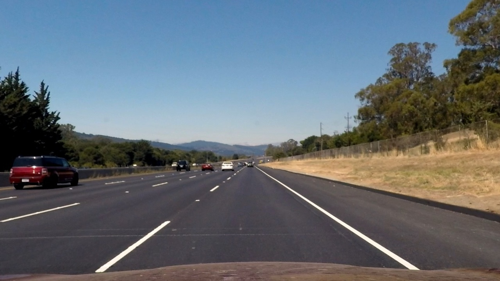
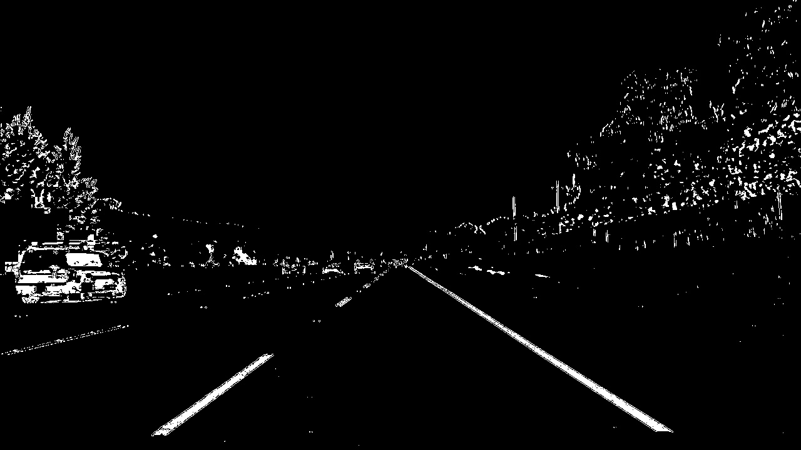
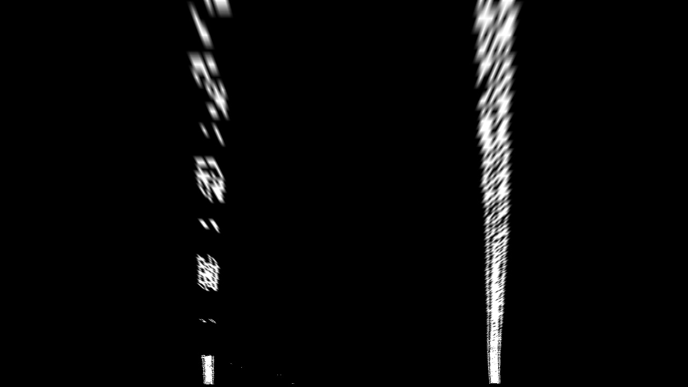
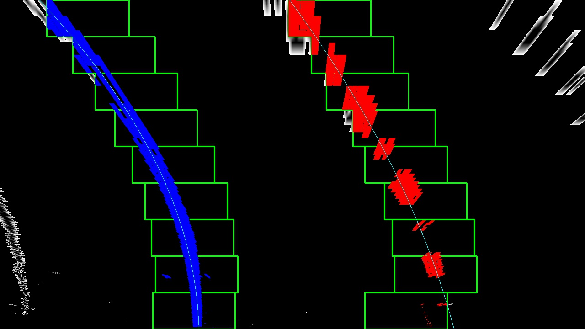
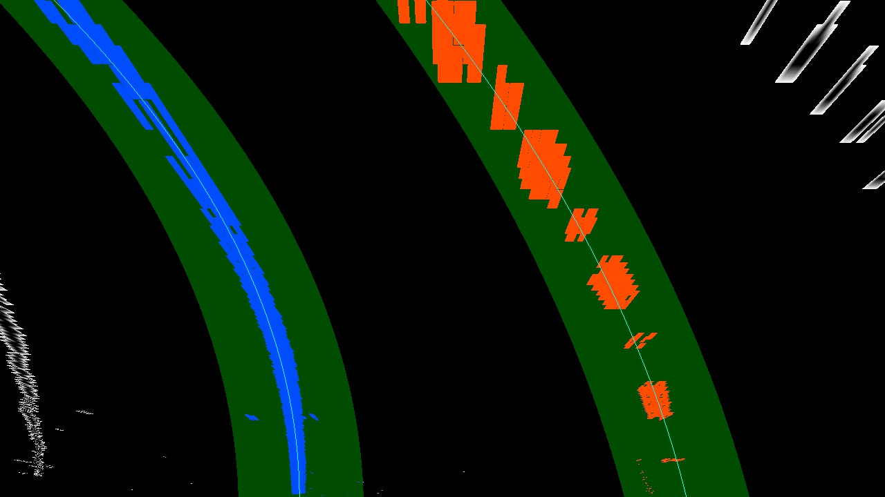
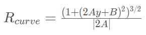
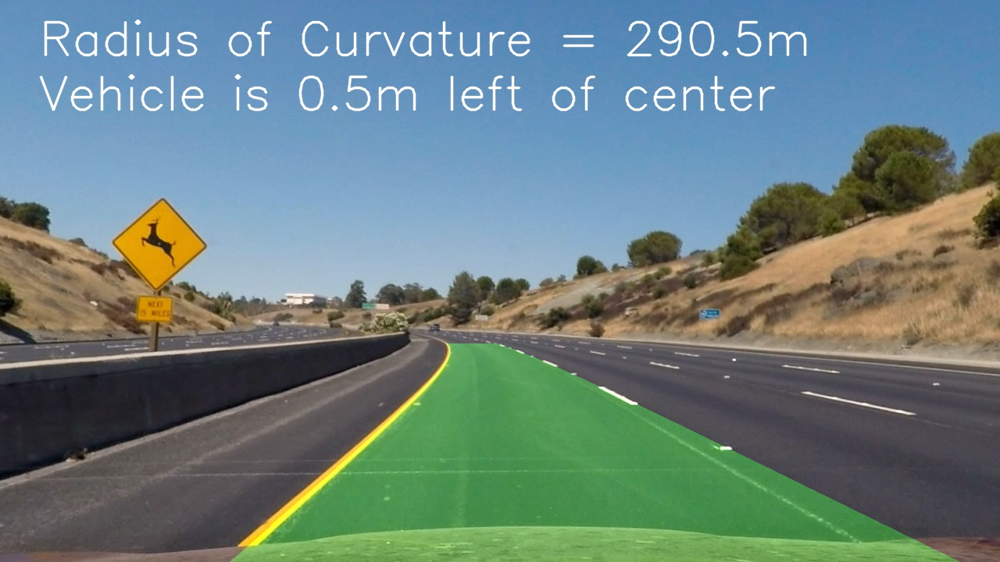

## Writeup Template

---

**Advanced Lane Finding Project**

The goals / steps of this project are the following:

* Compute the camera calibration matrix and distortion coefficients given a set of chessboard images.
* Apply a distortion correction to raw images.
* Use color transforms, gradients, etc., to create a thresholded binary image.
* Apply a perspective transform to rectify binary image ("birds-eye view").
* Detect lane pixels and fit to find the lane boundary.
* Determine the curvature of the lane and vehicle position with respect to center.
* Warp the detected lane boundaries back onto the original image.
* Output visual display of the lane boundaries and numerical estimation of lane curvature and vehicle position.

## [Rubric](https://review.udacity.com/#!/rubrics/571/view) Points

### Here I will consider the rubric points individually and describe how I addressed each point in my implementation.  

---

### Writeup / README

#### 1. Provide a Writeup / README that includes all the rubric points and how you addressed each one.  You can submit your writeup as markdown or pdf.  [Here](https://github.com/udacity/CarND-Advanced-Lane-Lines/blob/master/writeup_template.md) is a template writeup for this project you can use as a guide and a starting point.  

You're reading it!

### Camera Calibration

#### 1. Briefly state how you computed the camera matrix and distortion coefficients. Provide an example of a distortion corrected calibration image.

The code for this step is contained in [lane.py](lane.py#36) lines 36-79.

I start by preparing "object points", which will be the (x, y, z) coordinates of the chessboard corners in the world. Here I am assuming the chessboard is fixed on the (x, y) plane at z=0, such that the object points are the same for each calibration image.  Thus, `objp` is just a replicated array of coordinates, and `objpoints` will be appended with a copy of it every time I successfully detect all chessboard corners in a test image.  `imgpoints` will be appended with the (x, y) pixel position of each of the corners in the image plane with each successful chessboard detection.  

I then used the output `objpoints` and `imgpoints` to compute the camera calibration and distortion coefficients using the `cv2.calibrateCamera()` function.  I applied this distortion correction to the test image using the `cv2.undistort()` function and obtained this result: 


### Pipeline (single images)

#### 1. Provide an example of a distortion-corrected image.

Here I apply the distortion correction to one of the test images like this one:



#### 2. Describe how (and identify where in your code) you used color transforms, gradients or other methods to create a thresholded binary image.  Provide an example of a binary image result.

I used a combination of color and gradient thresholds to generate a binary image ([lane.py](lane.py#81) lines 81-110). I first convert the image to HLS color space and do thresholding on the S channel with (170, 255) thresholding limits. I then apply sobel kernel to the original image to get the gradients and threshold it to (40, 100). Finally I combined the results from those two steps to get the final thresholded binary image.

Here's an example of my output for this step.



#### 3. Describe how (and identify where in your code) you performed a perspective transform and provide an example of a transformed image.

I used the cv2.getPerspectiveTransform function to get the perspective transform matrix ([lane.py](lane.py#509) lines 509-514). I based my source points on visually analysing one of the test image, and taking the the position of the lane line on the bottom and at the end of the road.

To get the destination point, I defined this little formula:
```python
    left_point = 640 - ((640-TRANSFORM_SRC_POINT[2][0])*TRANSFORM_DEST_RATIO)
    right_point = 640 + ((TRANSFORM_SRC_POINT[3][0]-640)*TRANSFORM_DEST_RATIO)
    TRANSFORM_DEST_POINT = np.float32([[left_point,0],[right_point,0],[left_point,719],[right_point,719]])
```
As you can see, I defined a parameter called TRANSFORM_DEST_RATIO that defines how close the bird's eye veiwpoint is from the road. Bigger ratio means you are closer to the road, while smaller ratio means you are further up from the road. I define the ratio to be 0.6.

This resulted in the following source and destination points:

| Source        | Destination   | 
|:-------------:|:-------------:| 
| 609, 440      | 393, 0        | 
| 674, 440      | 927, 0        |
| 229, 719      | 393, 719      |
| 1119, 719     | 927, 719      |

I verified that my perspective transform was working as expected by drawing the source and destination points onto a test image and its warped counterpart to verify that the lines appear parallel in the warped image.



#### 4. Describe how (and identify where in your code) you identified lane-line pixels and fit their positions with a polynomial?

For identifying lane line pixels and getting their polynomial fit, I decided to use combination of sliding window, fit window, and with sanity checks to combat erroneous detections.

First, to get lane pixels from a single image without prior knowledge, I use the sliding window algorithm explained in the course ([lane.py](lane.py#131) lines 131-215). This in one example of this algorithm in action:



In the case of prior knowledge, which can mean that the previous frame's fitted polynomial is already known, we can use that information to detect lane lines on the new frame ([lane.py](lane.py#217) lines 217-271). This in one example of such detection:



Finally, to combat erroneous results, I employ several sanity checks after every detections ([lane.py](lane.py#306) lines 306-338). There are two kinds of sanity checs that I implemented, one regarding a single line and another one regarding both left and right lines. 

The single line sanity check will look at the line and raise a flag if the line does not have any pixels in the top half of the image. The logic being that if the line only consist of pixels in the bottom half, there is a high chance that the fitted line will not represent the actual lane line. If that happens, and if the other line is correct, then I will copy the other line's polynomial and offset it to the normal position of the line ([lane.py](lane.py#365) lines 365-375).

The both line sanity check will look at both lines and if the distance between them is more than the predetermined normal distance it will raise a flag. If that happens, or both line does not conform to the single line sanity checks, then I will discard the current detection and use the last detection from the previous frame ([lane.py](lane.py#377) lines 377-383).

#### 5. Describe how (and identify where in your code) you calculated the radius of curvature of the lane and the position of the vehicle with respect to center.

To calculate the radius of the curvature, I decided to use the formula explained in the course.



However, to get the value in meter, I first convert the fitted polynomial to meter by using the following formula, with `mx` and `my` being the scale for the x and y axis.
```
# Fit new polynomials to x,y in world space
left_fit_cr = np.polyfit(ploty*ym_per_pixleft_fitx*xm_per_pix, 2)
right_fit_cr = np.polyfit(ploty*ym_per_pix, right_fitx*xm_per_pix, 2)
```
I chose the scale to be the following:

| mx            | my            | 
|:-------------:|:-------------:| 
| 3.7/(927-393) | 32/720        | 

#### 6. Provide an example image of your result plotted back down onto the road such that the lane area is identified clearly.

I implemented this step in lines 442 through 469 in my code in [lane.py](lane.py#442) in the function `draw_detection()`.  Here is an example of my result on a test image:



---

### Pipeline (video)

#### 1. Provide a link to your final video output.  Your pipeline should perform reasonably well on the entire project video (wobbly lines are ok but no catastrophic failures that would cause the car to drive off the road!).

Here's a [link to my video result](./project_video_detected.mp4)

---

### Discussion

#### 1. Briefly discuss any problems / issues you faced in your implementation of this project.  Where will your pipeline likely fail?  What could you do to make it more robust?

One main problem that I think still remains in this project is the binary thresholding. My binary thresholding pipeline does provide a relatively good line pixels, but unfortunately it also extract unneeded pixels from other objects. This in turn made the lane detection pipeline to be difficult, especially in the case of changing lighting condition or pavement color. If I were to pursue this project further, I will definitely work on better thresholding process.

The other problems are the sanity checks logics. I tried with a couple of different sanity checks, but finally chose the relatively simple checking of pixels existance in the top half, and checking the distance between the two lane lines. There is definetely other way to do it, like checking the similarity of the line with the detected line from previous frame, or checking the curvature direction against the curvature from previous frame or the curvature of the other line, etc.

Finally, some parameter tuning on the line detection steps, if done more thoroughly may provide better results.
